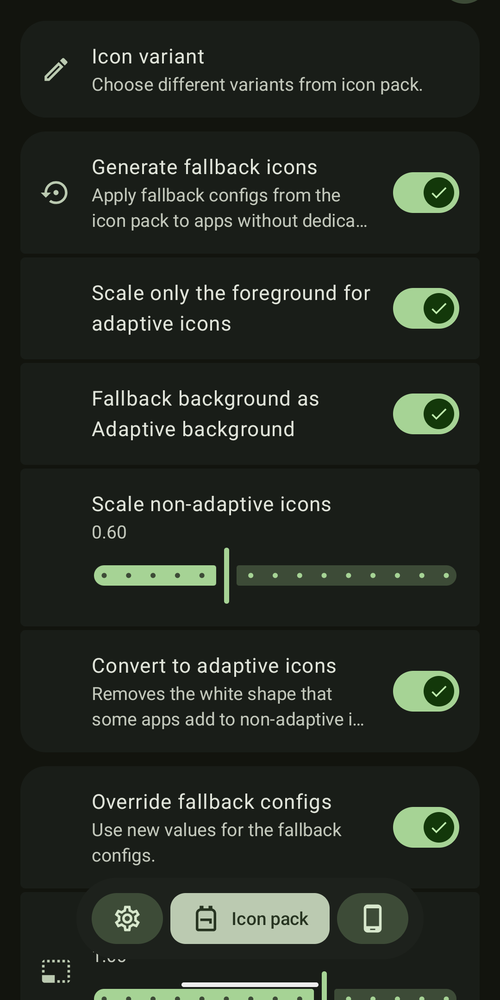

 

# Global Icon Pack
An Xposed module for applying icon packs globally

Some launchers support icon packs. However the icons are usually not consistent across the whole system. For example, while the app icons may change on the home screen, the Settings page and the Recent Apps screen often retain the default icons, not reflecting the updated look.

This module is designed to extend the customization of icon packs throughout the entire system.

## Preview

    
    
    
    

## Requirements
* AOSP based OS (I tested on android 14, 15)
* Magisk
* LSPosed

## Installation
1. Install the apk. 
2. Select the recommend apps in lsposed (Other launcher/apps may also work, depending on the api they use)
3. Open Global Icon Pack. Fill the `Icon pack` settings with an icon pack package name.
4. For pixel launcher and probably other similar launcher 3 based launcher, you will need to delete `/data/data/com.google.android.apps.nexuslauncher/databases/app_icons.db` then restart the launcher. Everytime you change settings, do this again.
5. Recent screen will use your default launcher unless you use quickswitch. So you will need to select pixel launcher for that to work.

## Known Issues
* If the launcher is slow to boot or crashes, switch to 'local' mode.

## Disclaimer
> [!WARNING]
> * Please note that this module may not be fully compatible with all custom ROMs. 
> * I do not take any responsibility for any damage or issues that may occur to your device.